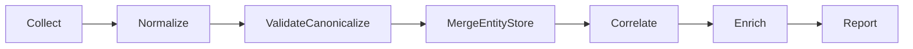

# Azure Analyzer v3 Architecture

## ETL pipeline (7 stages)



1. **Collect** -- tool plugins gather raw signals (Azure, Graph, CI/CD, cost).
2. **Normalize** -- each tool maps raw output into schema v2.
3. **Validate/Canonicalize** -- enforce schema, normalize IDs, deduplicate.
4. **Merge EntityStore** -- combine entity metadata + findings into a dual model.
5. **Correlate** -- cross-dimension relationships (identity <-> resources, CI/CD <-> repos).
6. **Enrich** -- add computed signals (scores, deltas, trend metadata).
7. **Report** -- render from `results.json` and `tool-status.json` into the static HTML template + Markdown. Reports currently consume the v1 flat format; entity-aware reporting is planned for Phase 5.

---

## Dual data model (entities + findings)

Azure Analyzer v3 stores **entities** and **findings** separately:

- **Entities** represent real-world resources (subscription, repo, user, app).
- **Findings** are observations about entities (compliant / non-compliant).

Each finding references its owning entity by canonical `EntityId`, while entities
aggregate all observations for reporting and correlation.

---

## Plugin model (tool-manifest.json)

Tools are declared in `tools/tool-manifest.json`. Each entry describes:

- Tool name, provider, and scope (subscription, MG, tenant, repo, ADO)
- Collector script path (`modules/Invoke-{Tool}.ps1`)
- Normalizer function name (`modules/normalizers/Normalize-{Tool}.ps1`)
- Required permissions/tier and prerequisites

The orchestrator loads the manifest, resolves eligible tools, and executes them
through the shared worker pool.

---

## Schema v2 overview (findings)

The full v2 finding schema has 24 fields. Key fields:

| Field | Type | Description |
|---|---|---|
| `Id` | string | Unique finding ID (GUID) |
| `Source` | string | Tool name (azqr, psrule, maester, scorecard, etc.) |
| `Category` | string | High-level category (Compliance, Identity, Supply Chain) |
| `Title` | string | Short finding title |
| `Severity` | string | `Critical`, `High`, `Medium`, `Low`, `Info` |
| `Compliant` | boolean | Whether the check passed |
| `Detail` | string | Human-readable context |
| `Remediation` | string | Recommended fix steps |
| `ResourceId` | string | Canonical resource/entity ID |
| `LearnMoreUrl` | string | Documentation or reference link |
| `EntityId` | string | Canonical entity identifier |
| `EntityType` | string | `AzureResource`, `Application`, `Repository`, etc. |
| `Platform` | string | `Azure`, `Entra`, `GitHub`, or `ADO` |
| `Provenance` | object | `{ RunId, Source, RawRecordRef, Timestamp }` |
| `SchemaVersion` | string | Currently `2.0` |

See `modules/shared/Schema.ps1` for the complete field list including `SubscriptionId`, `ResourceGroup`, `ManagementGroupPath`, `Frameworks`, `Controls`, `Confidence`, `EvidenceCount`, and `MissingDimensions`.

Entities use a separate schema with canonical `EntityId`, type, display name,
hierarchy, and metadata for correlation.

---

## Permission tiers (Tier 0–6)

| Tier | Scope | Enables |
|---|---|---|
| 0 | Local only | Report generation from existing JSON artifacts |
| 1 | Azure Reader | Subscription-scoped resource tools |
| 2 | Management Group Reader | MG-level governance tools |
| 3 | Microsoft Graph Read | Entra ID / identity tooling |
| 4 | GitHub / ADO Read | CI/CD and supply chain tooling |
| 5 | Cost Management Read | Cost analysis and spend findings |
| 6 | Optional AI access | AI enrichment / triage workflows |

---

## File structure (v3)

```text
azure-analyzer/
├── Invoke-AzureAnalyzer.ps1
├── report-template.html
├── modules/
│   ├── Invoke-*.ps1
│   ├── normalizers/
│   │   └── Normalize-*.ps1
│   └── shared/
│       ├── Schema.ps1
│       ├── Canonicalize.ps1
│       ├── EntityStore.ps1
│       ├── IdentityCorrelator.ps1
│       ├── Installer.ps1          # manifest-driven prereq installer
│       ├── RemoteClone.ps1        # HTTPS-only remote repo clone (cloud-first scanners)
│       ├── Retry.ps1              # jittered retry w/ status & message predicates
│       ├── Sanitize.ps1           # Remove-Credentials
│       ├── WorkerPool.ps1
│       ├── Checkpoint.ps1
│       └── ...
├── tools/
│   └── tool-manifest.json
├── docs/
│   ├── ARCHITECTURE.md
│   └── CONTRIBUTING-TOOLS.md
├── tests/
│   ├── fixtures/
│   └── normalizers/
└── output/
    ├── results.json
    ├── entities.json
    ├── tool-status.json
    ├── errors.json
    ├── report.html
    └── report.md
```

---

## Normalizers (Phase 1–3)

Each of the 12 tools has a dedicated normalizer function that converts raw tool output into the unified schema v2 FindingRow format.

### Normalizer responsibilities

- **Parse raw findings** -- read output from tool wrapper
- **Extract resource context** -- parse ARM ResourceIds to extract subscriptionId, resourceGroup, resourceType, resourceName
- **Map schema** -- convert tool-specific fields into v2 fields (Source, Category, Title, Severity, Compliant, Detail, Remediation, ResourceId, LearnMoreUrl)
- **Platform/Entity mapping** -- determine owning platform and entity type per tool:
  - Azure tools (azqr, PSRule, ALZ Queries, WARA) -> Platform: `Azure`, EntityType: `AzureResource`
  - AzGovViz -> Platform: `Azure`, EntityType varies by finding context: `ManagementGroup` for MG-level governance findings, `Subscription` for bare subscription paths, `AzureResource` for deeper ARM resource paths
  - Entra ID tool (Maester) -> Platform: `Entra`. Per-app checks emit EntityType `Application`; **tenant-wide baseline checks emit a synthetic `Tenant` entity** (the tenant itself owns the finding, not any single app). Severity extraction uses word-boundary regex (`\bcritical\b`, `\bhigh\b`, etc.) so strings like "criticality" no longer match "critical".
  - Repository tool (Scorecard) -> Platform: `GitHub`, EntityType: `Repository`
  - CI/CD security tools (zizmor, gitleaks, Trivy) -> Platform: `GitHub`, EntityType: `Repository` (local CLI tools, no cloud permissions)
- **Return findings only** -- no side effects, return array of v2-compliant findings

### Normalizer locations

| Tool | Normalizer | Entity Type |
|---|---|---|
| azqr | `modules/normalizers/Normalize-Azqr.ps1` | AzureResource |
| PSRule | `modules/normalizers/Normalize-PSRule.ps1` | AzureResource |
| AzGovViz | `modules/normalizers/Normalize-AzGovViz.ps1` | ManagementGroup / Subscription / AzureResource |
| ALZ Queries | `modules/normalizers/Normalize-AlzQueries.ps1` | AzureResource |
| WARA | `modules/normalizers/Normalize-WARA.ps1` | AzureResource |
| Maester | `modules/normalizers/Normalize-Maester.ps1` | Application / Tenant |
| Scorecard | `modules/normalizers/Normalize-Scorecard.ps1` | Repository |
| Identity Correlator | `modules/normalizers/Normalize-IdentityCorrelation.ps1` | ServicePrincipal |
| zizmor | `modules/normalizers/Normalize-Zizmor.ps1` | Repository |
| gitleaks | `modules/normalizers/Normalize-Gitleaks.ps1` | Repository |
| Trivy | `modules/normalizers/Normalize-Trivy.ps1` | Repository |

### Manifest-driven invocation

The orchestrator loads `tools/tool-manifest.json`, which specifies the normalizer path for each tool. After a tool collector returns `Findings`, the manifest entry's `normalizer` script is invoked to transform findings into v2 format before they enter the entity store pipeline.

---

## CI/CD Security Stage (Phase 3)

Phase 3 adds three local CLI tools that scan the repository checkout for security issues.
These tools have `provider=cli` and `scope=repository` in the manifest. Unlike cloud-scoped
tools, they require no API tokens or permissions -- only the CLI binary on PATH.

| Tool | What it detects | Category |
|---|---|---|
| **zizmor** | GitHub Actions workflow vulnerabilities (expression injection, untrusted inputs, dangerous triggers) | CI/CD Security |
| **gitleaks** | Hardcoded secrets in source code and git history (API keys, tokens, passwords, certificates) | Secrets |
| **Trivy** | Known CVEs in dependency manifests (package-lock.json, requirements.txt, go.sum, pom.xml) | Supply Chain |

### CLI-provider orchestrator behavior

Repository-scoped tools with `provider=cli` are handled differently from `provider=github` tools:

- **Always eligible**: CLI tools run whenever enabled, regardless of whether `-Repository` is provided
- **Local filesystem**: They scan the working directory (or `-ScanPath` for Trivy)
- **Graceful skip**: If the CLI binary is not installed, the wrapper returns `Status=Skipped` with install instructions
- **No rate limits**: No API calls, no tokens, no rate limit concerns

---

## Correlation stage (Phase 2)

The correlation stage runs after entity merge and before enrichment. It connects
identities that span multiple platforms without bulk-enumerating tenant SPNs.

### Identity correlator (`modules/shared/IdentityCorrelator.ps1`)

**Strategy -- candidate reduction, not bulk enumeration:**

1. **Seed candidates** from existing entity store data: extract appIds, objectIds,
   and SPN display names from Azure RBAC findings, ADO service connections,
   GitHub OIDC subjects, and Entra identity entities.
2. **Cross-reference** each candidate across dimensions (Azure, Entra, GitHub, ADO).
3. **Optional Graph enrichment** (`-IncludeGraphLookup`): look up federated identity
   credentials for candidate apps via `Get-MgApplication` + `Get-MgApplicationFederatedIdentityCredential`.
   Requires Security Reader. Opt-in only.
4. **Emit findings** as v3 FindingRow objects with confidence scoring:
   - Confirmed: same appId in 3+ dimensions with direct evidence
   - Likely: same appId in 2 dimensions
   - Unconfirmed: name-based correlation only

**Output**: Informational findings (Severity=Info, Compliant=true) with Confidence,
EvidenceCount, and MissingDimensions fields. Checkpoint-compatible via Identity scope.

### Normalizer

`modules/normalizers/Normalize-IdentityCorrelation.ps1` is a passthrough -- the
correlator already emits valid FindingRow objects.

---

## EntityType taxonomy

The v3 schema defines **12 EntityTypes** across **4 platforms**. Every finding and entity MUST use one of these. The taxonomy is the authoritative join key for cross-tool correlation.

| EntityType | Platform | Emitted by |
|---|---|---|
| `AzureResource` | Azure | azqr, PSRule, AzGovViz (deep ARM paths), ALZ Queries, WARA |
| `Subscription` | Azure | AzGovViz (subscription-scope findings), orchestrator (entity seed) |
| `ManagementGroup` | Azure | AzGovViz (MG-scope findings) |
| `ManagedIdentity` | Azure | Identity Correlator |
| `Application` | Entra | Maester (per-app findings), Identity Correlator |
| `ServicePrincipal` | Entra | Identity Correlator |
| `User` | Entra | Identity Correlator |
| `Tenant` | Entra | **Maester synthetic entity** (tenant-wide baseline checks that don't belong to any single app) |
| `Repository` | GitHub | Scorecard, gitleaks, Trivy (when repo-scoped) |
| `Workflow` | GitHub | zizmor |
| `Pipeline` | ADO | (reserved -- future ADO pipeline scanner) |
| `ServiceConnection` | ADO | ADO Connections |

Platform mapping is deterministic: given an EntityType, `Get-PlatformForEntityType` (in `Schema.ps1`) returns exactly one platform.

---

## Manifest-driven pipeline (`tools/tool-manifest.json`)

`tools/tool-manifest.json` is the single source of truth for tool registration. The orchestrator, installer, and reports all read from it. Every tool entry declares:

- **Registration** — `name`, `displayName`, `source`, `provider`, `scope`, `enabled`, `platforms`
- **Collection** — `script` (collector path), `invokeMethod`, `requiredParams`, `optionalParams`
- **Normalization** — `normalizer` (function name under `modules/normalizers/`)
- **Permissions** — `requiredPermissionTier` (0–6, see tiers below)
- **`install` block** — how `-InstallMissingModules` provisions this tool (see Installer below)
- **`report` block** — `color` (hex, for per-source bars) and `phase` (grouping hint for HTML + MD reports)

Because both the installer and the report generators consume the manifest, adding a tool to the manifest automatically surfaces it in install flows, tool coverage, per-source bars, and findings-by-source tables.

---

## Installer (`modules/shared/Installer.ps1`)

Manifest-driven prerequisite installer, gated by the `-InstallMissingModules` switch on `Invoke-AzureAnalyzer.ps1`. Supports four `install.kind` values:

| Kind | What it does |
|---|---|
| `psmodule` | `Install-Module` from PSGallery (PSRule, WARA, Maester, Az.ResourceGraph) |
| `cli` | Package-manager install via one of an allow-listed set: `winget`, `brew`, `pipx`, `pip`, `snap`. Package name is validated against a safe-name regex before invocation. |
| `gitclone` | HTTPS-only `git clone` into `tools/<name>/`. Target URL must match a host allow-list (currently: github.com). Used for AzGovViz auto-bootstrap. |
| `none` | No-op (nothing to install) |

**Security controls:**
- Package-name regex — rejects unsafe names before spawning a package manager
- Allow-listed package managers — unknown managers are refused
- HTTPS-only git clone with host allow-list
- 300-second timeout on external commands
- All stdout/stderr scrubbed via `Remove-Credentials` before emission
- Rich error objects via `New-InstallerError` / `Write-InstallerError`
- Transient failures retried via `Invoke-WithInstallRetry` (jittered exponential backoff)

---

## Remote clone helper (`modules/shared/RemoteClone.ps1`)

Used by cloud-first scanners (zizmor, gitleaks, trivy) to fetch a remote repo for scanning. Enforces:

- **HTTPS only** — `git://`, `ssh://`, and `file://` are refused
- **Host allow-list** — `github.com`, `dev.azure.com`, `*.visualstudio.com`, `*.ghe.com`
- **Token scrub** — any auth token injected into the clone URL is stripped from `.git/config` immediately after clone
- **Temp dir cleanup** — clones are cleaned up in `finally` blocks

This is the migration path for the three local scanners; local-path scanning remains available as a fallback.

---

## Retry helper (`modules/shared/Retry.ps1`)

`Invoke-WithRetry` wraps any scriptblock with jittered exponential backoff. Retries on:

- **HTTP status codes** — 408, 429, 500, 502, 503, 504
- **Exception message patterns** — `429`, `503`, `throttle`, `throttled`, `timeout`, `timed out`, `connection reset`, `socket`, `transient`
- Custom predicate (via `-ShouldRetry`)

This makes REST and `Search-AzGraph` calls resilient to throttling. `Invoke-AlzQueries.ps1` wraps `Search-AzGraph` in `Invoke-WithRetry` for 429/503 resilience across large tenants.

---

## Normalizer v1 → v3 contract

Every tool wrapper returns a **v1 result envelope**:

```powershell
[PSCustomObject]@{
    Source   = 'tool-name'
    Status   = 'Success' | 'Skipped' | 'Failed' | 'PartialSuccess'
    Message  = '...'
    Findings = @( <raw tool-specific objects> )
}
```

Each tool's normalizer is invoked by the orchestrator with `-ToolResult <envelope>` and must produce an array of **v2 FindingRow** objects (24 fields, see `modules/shared/Schema.ps1`). Normalizers:

1. Validate the envelope (`Status -ne 'Success'` -> return `@()`)
2. Parse raw findings; extract ARM context when possible via `ConvertTo-CanonicalArmId` / `ConvertTo-CanonicalRepoId`
3. Call `New-FindingRow` for each finding, populating required fields (`Id`, `Source`, `EntityId`, `EntityType`, `Title`, `Compliant`, `ProvenanceRunId`) plus all available optional fields
4. Return the array — **no side effects, no throws**

The EntityStore pipeline then canonicalizes IDs, deduplicates on composite key (`Source+ResourceId+Category+Title+Compliant`), merges findings into entities, and exports both `results.json` (v1 flat, 10-field contract) and `entities.json` (v3 entity model).

---

- **Collectors never throw:** each wrapper returns `Source`, `Status`, `Message`, and `Findings`.
- **Worker pool isolation:** one tool failure does not stop others.
- **Tool status tracking:** orchestrator writes `tool-status.json` with per-tool Status, Message, and finding count. Reports use this to distinguish success-with-zero-findings from skipped/failed.
- **Errors are captured:** orchestrator records failures in `errors.json`.
- **Exit codes:** CI/CD uses 0–3 exit codes (success, policy violation, partial failure, total failure).
- **Checkpoint/resume:** tool results are serialized per scope for long-running scans.

---
