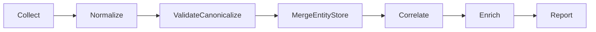

# Azure Analyzer v3 Architecture

## ETL pipeline (7 stages)



1. **Collect** -- tool plugins gather raw signals (Azure, Graph, CI/CD, cost).
2. **Normalize** -- each tool maps raw output into schema v2.
3. **Validate/Canonicalize** -- enforce schema, normalize IDs, deduplicate.
4. **Merge EntityStore** -- combine entity metadata + findings into a dual model.
5. **Correlate** -- cross-dimension relationships (identity <-> resources, CI/CD <-> repos).
6. **Enrich** -- add computed signals (scores, deltas, trend metadata).
7. **Report** -- render from `results.json` and `tool-status.json` into the static HTML template + Markdown. Reports currently consume the v1 flat format; entity-aware reporting is planned for Phase 5.

---

## Dual data model (entities + findings)

Azure Analyzer v3 stores **entities** and **findings** separately:

- **Entities** represent real-world resources (subscription, repo, user, app).
- **Findings** are observations about entities (compliant / non-compliant).

Each finding references its owning entity by canonical `EntityId`, while entities
aggregate all observations for reporting and correlation.

---

## Plugin model (tool-manifest.json)

Tools are declared in `tools/tool-manifest.json`. Each entry describes:

- Tool name, provider, and scope (subscription, MG, tenant, repo, ADO)
- Collector script path (`modules/Invoke-{Tool}.ps1`)
- Normalizer function name (`modules/normalizers/Normalize-{Tool}.ps1`)
- Required permissions/tier and prerequisites

The orchestrator loads the manifest, resolves eligible tools, and executes them
through the shared worker pool.

---

## Schema v2 overview (findings)

The full v2 finding schema has 24 fields. Key fields:

| Field | Type | Description |
|---|---|---|
| `Id` | string | Unique finding ID (GUID) |
| `Source` | string | Tool name (azqr, psrule, maester, scorecard, etc.) |
| `Category` | string | High-level category (Compliance, Identity, Supply Chain) |
| `Title` | string | Short finding title |
| `Severity` | string | `Critical`, `High`, `Medium`, `Low`, `Info` |
| `Compliant` | boolean | Whether the check passed |
| `Detail` | string | Human-readable context |
| `Remediation` | string | Recommended fix steps |
| `ResourceId` | string | Canonical resource/entity ID |
| `LearnMoreUrl` | string | Documentation or reference link |
| `EntityId` | string | Canonical entity identifier |
| `EntityType` | string | `AzureResource`, `Application`, `Repository`, etc. |
| `Platform` | string | `Azure`, `Entra`, `GitHub`, or `ADO` |
| `Provenance` | object | `{ RunId, Source, RawRecordRef, Timestamp }` |
| `SchemaVersion` | string | Currently `2.0` |

See `modules/shared/Schema.ps1` for the complete field list including `SubscriptionId`, `ResourceGroup`, `ManagementGroupPath`, `Frameworks`, `Controls`, `Confidence`, `EvidenceCount`, and `MissingDimensions`.

Entities use a separate schema with canonical `EntityId`, type, display name,
hierarchy, and metadata for correlation.

---

## Permission tiers (Tier 0–6)

| Tier | Scope | Enables |
|---|---|---|
| 0 | Local only | Report generation from existing JSON artifacts |
| 1 | Azure Reader | Subscription-scoped resource tools |
| 2 | Management Group Reader | MG-level governance tools |
| 3 | Microsoft Graph Read | Entra ID / identity tooling |
| 4 | GitHub / ADO Read | CI/CD and supply chain tooling |
| 5 | Cost Management Read | Cost analysis and spend findings |
| 6 | Optional AI access | AI enrichment / triage workflows |

---

## File structure (v3)

```text
azure-analyzer/
├── Invoke-AzureAnalyzer.ps1
├── report-template.html
├── modules/
│   ├── Invoke-*.ps1
│   ├── normalizers/
│   │   └── Normalize-*.ps1
│   └── shared/
│       ├── Schema.ps1
│       ├── Canonicalize.ps1
│       ├── EntityStore.ps1
│       ├── IdentityCorrelator.ps1
│       ├── WorkerPool.ps1
│       ├── Checkpoint.ps1
│       └── ...
├── tools/
│   └── tool-manifest.json
├── docs/
│   ├── ARCHITECTURE.md
│   └── CONTRIBUTING-TOOLS.md
├── tests/
│   ├── fixtures/
│   └── normalizers/
└── output/
    ├── results.json
    ├── entities.json
    ├── tool-status.json
    ├── errors.json
    ├── report.html
    └── report.md
```

---

## Normalizers (Phase 1)

Each of the 7 tools has a dedicated normalizer function that converts raw tool output into the unified schema v2 FindingRow format.

### Normalizer responsibilities

- **Parse raw findings** -- read output from tool wrapper
- **Extract resource context** -- parse ARM ResourceIds to extract subscriptionId, resourceGroup, resourceType, resourceName
- **Map schema** -- convert tool-specific fields into v2 fields (Source, Category, Title, Severity, Compliant, Detail, Remediation, ResourceId, LearnMoreUrl)
- **Platform/Entity mapping** -- determine owning platform and entity type per tool:
  - Azure tools (azqr, PSRule, ALZ Queries, WARA) -> Platform: `Azure`, EntityType: `AzureResource`
  - AzGovViz -> Platform: `Azure`, EntityType varies by finding context: `ManagementGroup` for MG-level governance findings, `Subscription` for bare subscription paths, `AzureResource` for deeper ARM resource paths
  - Entra ID tool (Maester) -> Platform: `Entra`, EntityType: `Application`
  - Repository tool (Scorecard) -> Platform: `GitHub`, EntityType: `Repository`
- **Return findings only** -- no side effects, return array of v2-compliant findings

### Normalizer locations

| Tool | Normalizer | Entity Type |
|---|---|---|
| azqr | `modules/normalizers/Normalize-Azqr.ps1` | AzureResource |
| PSRule | `modules/normalizers/Normalize-PSRule.ps1` | AzureResource |
| AzGovViz | `modules/normalizers/Normalize-AzGovViz.ps1` | ManagementGroup / Subscription / AzureResource |
| ALZ Queries | `modules/normalizers/Normalize-AlzQueries.ps1` | AzureResource |
| WARA | `modules/normalizers/Normalize-WARA.ps1` | AzureResource |
| Maester | `modules/normalizers/Normalize-Maester.ps1` | Application |
| Scorecard | `modules/normalizers/Normalize-Scorecard.ps1` | Repository |
| Identity Correlator | `modules/normalizers/Normalize-IdentityCorrelation.ps1` | ServicePrincipal |

### Manifest-driven invocation

The orchestrator loads `tools/tool-manifest.json`, which specifies the normalizer path for each tool. After a tool collector returns `Findings`, the manifest entry's `normalizer` script is invoked to transform findings into v2 format before they enter the entity store pipeline.

---

## Correlation stage (Phase 2)

The correlation stage runs after entity merge and before enrichment. It connects
identities that span multiple platforms without bulk-enumerating tenant SPNs.

### Identity correlator (`modules/shared/IdentityCorrelator.ps1`)

**Strategy -- candidate reduction, not bulk enumeration:**

1. **Seed candidates** from existing entity store data: extract appIds, objectIds,
   and SPN display names from Azure RBAC findings, ADO service connections,
   GitHub OIDC subjects, and Entra identity entities.
2. **Cross-reference** each candidate across dimensions (Azure, Entra, GitHub, ADO).
3. **Optional Graph enrichment** (`-IncludeGraphLookup`): look up federated identity
   credentials for candidate apps via `Get-MgApplication` + `Get-MgApplicationFederatedIdentityCredential`.
   Requires Security Reader. Opt-in only.
4. **Emit findings** as v3 FindingRow objects with confidence scoring:
   - Confirmed: same appId in 3+ dimensions with direct evidence
   - Likely: same appId in 2 dimensions
   - Unconfirmed: name-based correlation only

**Output**: Informational findings (Severity=Info, Compliant=true) with Confidence,
EvidenceCount, and MissingDimensions fields. Checkpoint-compatible via Identity scope.

### Normalizer

`modules/normalizers/Normalize-IdentityCorrelation.ps1` is a passthrough -- the
correlator already emits valid FindingRow objects.

---

- **Collectors never throw:** each wrapper returns `Source`, `Status`, `Message`, and `Findings`.
- **Worker pool isolation:** one tool failure does not stop others.
- **Tool status tracking:** orchestrator writes `tool-status.json` with per-tool Status, Message, and finding count. Reports use this to distinguish success-with-zero-findings from skipped/failed.
- **Errors are captured:** orchestrator records failures in `errors.json`.
- **Exit codes:** CI/CD uses 0–3 exit codes (success, policy violation, partial failure, total failure).
- **Checkpoint/resume:** tool results are serialized per scope for long-running scans.
